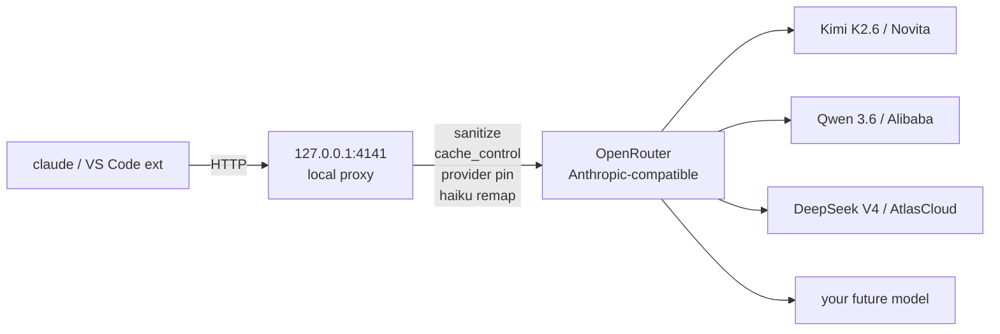

# Claude Code on OpenRouter — LTS Installer

Run the **official Claude Code CLI** and **VS Code extension** through any **OpenRouter** model, without losing tools, file editing, bash, MCP, or repo workflow.

[](#platform-status)
[](#platform-status)
[](#requirements)
[](docs/SECURITY.md)
[](#whats-included)

---

## Quick Start

```sh
# 1. Install official Claude Code (only if missing)
curl -fsSL https://claude.ai/install.sh | bash

# 2. Clone this repo
git clone https://github.com/allytag/Claude_Code.git Claude && cd Claude

# 3. Preview what will happen (no writes)
./install.sh --dry-run

# 4. Install (prompts for OpenRouter key, hidden input)
./install.sh --merge

# 5. Use it
claude            # full Claude Code, routed through OpenRouter
claude-router status
```

That's it. Claude Code now runs on your chosen OpenRouter model with full tool access.

---

## Why This Exists

| Problem | This installer's answer |
|---|---|
| Claude Code is locked to Anthropic's billing | Routes through OpenRouter to any compatible model |
| Custom-model setups break Claude Code's tools/file editing | Preserves the full agentic protocol — no compromise mode |
| Hidden reasoning tokens silently inflate cost | Strips reasoning fields by default, registry-gated pass-through for hard tasks |
| No cache → 24 K-token floor on every turn | Auto-injects cache markers + provider pinning (observed 57% turn-2 cost drop on Kimi+Novita) |
| Auto-updates can break your custom config | `claude-safe-update` with CLI + extension snapshots, validation, rollback |
| Setup state spread across many files | Single registry + doctor + cleanup tool |

---

## What's Included

<table>
<tr><th>Feature</th><th>What it does</th></tr>
<tr><td><b>Original Claude Code</b></td><td>Official CLI preserved; VS Code extension patched reversibly for OpenRouter compatibility. All tools, file edits, bash, repo, MCP work.</td></tr>
<tr><td><b>Local proxy</b></td><td>Anthropic-compatible endpoint at <code>127.0.0.1:4141</code>, forwards to OpenRouter. Strips thinking fields, sanitizes responses.</td></tr>
<tr><td><b>Model registry</b></td><td>Roles (main / cheapFull / hard / subagent / lowToken / backup / compare) → OpenRouter model IDs. Swap any time.</td></tr>
<tr><td><b>Smart caching</b></td><td>Auto-inject Anthropic cache_control markers. Provider pinning via registry to keep cache continuity.</td></tr>
<tr><td><b>Internal Haiku remap</b></td><td>Claude Code's silent background Haiku calls re-routed to your <code>cheapFull</code> model. Safety-gated (no tools, ≤2 messages).</td></tr>
<tr><td><b>Reasoning policy</b></td><td>Reasoning passes through only for registry-allowlisted models on <code>/effort high</code>. Others stripped to prevent surprise cost.</td></tr>
<tr><td><b>Doctor + cleanup</b></td><td>Health, drift detection, cache readiness, stale-data cleanup. Caveman/Desktop/projects protected.</td></tr>
<tr><td><b>Safe updates</b></td><td><code>claude-safe-update</code> snapshots CLI + VS Code extension, runs official installers with timeout, patches, validates, restores on failure.</td></tr>
<tr><td><b>LTS env injection</b></td><td>Wrappers boot-resilient. Survives reboots, fresh shells, OS updates.</td></tr>
</table>

---

## Comparison

| | Raw Claude Code (Anthropic) | Raw OpenAI gateway | This setup |
|---|---|---|---|
| Tools, file edit, MCP | ✅ | ⚠️ varies | ✅ preserved |
| OpenRouter custom models | ❌ | ❌ | ✅ |
| Anthropic prompt cache | ✅ | ❌ | ✅ (provider-dependent) |
| Provider pinning | ❌ | ❌ | ✅ |
| Update safety | manual | manual | ✅ snapshot+rollback |
| Cost guard / metrics | partial | none | ✅ privacy-safe metrics |
| No vendor lock-in | ❌ | partial | ✅ swap any OpenRouter model |

---

## Requirements

See [Platform Status](#platform-status) before installing.

**Required**
- macOS Apple Silicon (M-series) for LTS installer
- Node.js ≥ 20
- Zsh
- Official Claude Code CLI ([install](https://code.claude.com/docs/en/setup))
- OpenRouter API key

**Optional**
- VS Code + the official `anthropic.claude-code` extension

If VS Code is missing the installer skips that step and continues CLI-only.

## Platform Status

| Platform | Status | Installer | Notes |
|---|---|---|---|
| macOS Apple Silicon | **LTS** | `./install.sh` | Primary supported path. Uses LaunchAgent and macOS VS Code paths. |
| Linux | **Beta** | `node platforms/linux/install.mjs` | Isolated support path using `systemd --user`. |
| Windows | **Beta** | `node platforms/windows/install.mjs` | Isolated support path using `.cmd` wrappers and optional Task Scheduler. |

The macOS installer flow is not shared with beta platform installers. Linux/Windows support can grow without changing the locked macOS LTS path.

---

## Install

<details open>
<summary><b>Quick install (default, recommended)</b></summary>

```sh
git clone https://github.com/allytag/Claude_Code.git Claude && cd Claude
./install.sh --dry-run     # always preview first
./install.sh --merge       # prompts for OpenRouter key, hidden input
```

The `--merge` mode preserves any existing `~/.claude/settings.json` keys (MCP, hooks, plugins, your token) and only writes what's needed.

</details>

<details>
<summary><b>Non-interactive install (CI / scripted)</b></summary>

```sh
read -s OPENROUTER_API_KEY        # paste key, hidden
./install.sh --merge --api-key-env OPENROUTER_API_KEY --yes
unset OPENROUTER_API_KEY
```

</details>

<details>
<summary><b>Fresh install (empty target only)</b></summary>

```sh
./install.sh --fresh       # refuses if ~/.claude already has setup
```

</details>

<details>
<summary><b>Upgrade existing install</b></summary>

```sh
git pull
./install.sh --dry-run
./install.sh --upgrade     # preserves token + role choices
```

See [docs/UPDATE.md](docs/UPDATE.md).

</details>

---

## Daily Commands

| Task | Command |
|---|---|
| Use Claude Code (full mode) | `claude` |
| Live token/cost tail | `claude-router tail` |
| System health | `claude-router status` |
| List models in registry | `claude-router list` |
| One-off model test (no role change) | `claude-model kimi-k2.6 -p "say hi"` |
| Switch the `main` role | `claude-router use main deepseek-v4-pro` |
| Add a new OpenRouter model | `claude-router add grok x-ai/grok-4 --name "Grok 4"` |
| Low-token Q&A (no tools) | `claude-low "explain debounce"` |
| Cleanup stale data (dry-run first) | `claude-router cleanup all-safe` |
| Cleanup apply | `claude-router cleanup all-safe --apply` |
| Update Claude Code safely | `claude-safe-update latest --dry-run` then `claude-safe-update latest` |
| Run doctor | `node ~/.claude/openrouter-claude-proxy/doctor.mjs` |

Full daily workflow in [docs/INSTALL.md](docs/INSTALL.md#daily-workflow).

---

## Default Model Roles

```text
main      → moonshotai/kimi-k2.6        (observed cache; Novita pin)
cheapFull → qwen/qwen3.6-plus           (cheap, large context)
hard      → deepseek/deepseek-v4-pro    (manual; reasoning passes through)
subagent  → qwen/qwen3.6-plus
lowToken  → qwen/qwen3.6-plus
backup    → deepseek/deepseek-v4-pro
compare   → z-ai/glm-5.1
```

Roles map to Claude Code's `sonnet` / `haiku` / `opus` slots automatically. Change any role with `claude-router use <role> <alias>`. Apply to settings with `claude-router apply-settings`.

---

## Architecture (one diagram)



Full design in [docs/ARCHITECTURE.md](docs/ARCHITECTURE.md).

---

## Safety Guarantees

- ✅ **Never** touches Claude Desktop, caveman plugin, unrelated projects.
- ✅ **No** API key in this repo. Redaction check enforced (`scripts/redact-check.mjs`).
- ✅ **No** model calls during install or doctor (unless you opt in with `--probe --allow-model-call`).
- ✅ **All** edits backed up to `~/.claude/installer-backups/openrouter-lts-<stamp>/`.
- ✅ **Idempotent** — re-running install is safe.
- ✅ **Reversible** — `./uninstall.sh --restore-last-backup` rolls back.

Threat model and what's protected vs. not: [docs/SECURITY.md](docs/SECURITY.md).

---

## FAQ

<details>
<summary><b>Will this break Claude Code's tools, file edits, or MCP?</b></summary>

No. Full Claude Code mode is preserved — same tool contract, same protocol, same UI. The proxy only sanitizes thinking blocks and adds cache markers; tool calls and tool results pass through untouched. Verified by file-edit smoke test.

</details>

<details>
<summary><b>Does my OpenRouter key end up in the repo?</b></summary>

No. The installer prompts for it (hidden input) and writes it only to `~/.claude/settings.json` on the target machine. The repo's redaction check refuses any commit containing `sk-or-` or a real auth token.

</details>

<details>
<summary><b>What about Claude Desktop / Anthropic billing?</b></summary>

Untouched. The installer detects and reports Claude Desktop but never modifies it. Your Claude Desktop subscription, login, and config are unaffected.

</details>

<details>
<summary><b>How much does it actually save?</b></summary>

On Kimi K2.6 + Novita pinning: turn 2 of any session drops from $0.020 → $0.009 (57% cheaper) once cache warms. Verified with real OpenRouter calls.

</details>

<details>
<summary><b>What if a Claude Code update breaks something?</b></summary>

`claude-safe-update` snapshots the current CLI binary and Claude Code VS Code extension, runs the official update steps with a timeout, patches the extension, validates the full stack (size, executable, version check, doctor, proxy health, extension patch), and restores snapshots if any critical check fails. You always have a known-good rollback.

</details>

<details>
<summary><b>Can I add a new OpenRouter model later?</b></summary>

Yes. `claude-router add <alias> <provider/model-id> --name "Display Name"`, then `claude-router use <role> <alias>` to assign it. No re-install needed.

</details>

<details>
<summary><b>Linux or Windows support?</b></summary>

Linux and Windows support exists in isolated beta folders:

```sh
node platforms/linux/install.mjs --dry-run --merge
```

```powershell
node platforms/windows/install.mjs --dry-run --merge
```

These installers are isolated from the macOS LTS flow and include dry-run preflight checks.

</details>

<details>
<summary><b>How do I uninstall?</b></summary>

```sh
./uninstall.sh                       # removes proxy, wrappers, LaunchAgent
./uninstall.sh --restore-last-backup # rolls back to pre-install state
```

Claude Code itself stays installed.

</details>

---

## Troubleshooting

Common fixes in [docs/TROUBLESHOOTING.md](docs/TROUBLESHOOTING.md). Doctor and verify scripts cover most cases:

```sh
./verify.sh
node ~/.claude/openrouter-claude-proxy/doctor.mjs
```

---

## Documentation

| File | Topic |
|---|---|
| [docs/INSTALL.md](docs/INSTALL.md) | Step-by-step install + daily workflow |
| [docs/ARCHITECTURE.md](docs/ARCHITECTURE.md) | Request flow, components, design decisions |
| [docs/SECURITY.md](docs/SECURITY.md) | Threat model, redaction, what's protected |
| [docs/UPDATE.md](docs/UPDATE.md) | Safe Claude CLI updates, repo upgrades |
| [docs/TROUBLESHOOTING.md](docs/TROUBLESHOOTING.md) | Problem → fix pairs |

---

## License

MIT. See [LICENSE](LICENSE).

## Contributing

Issues and PRs welcome. Before committing, run:

```sh
node scripts/redact-check.mjs    # blocks any secret leak
node scripts/build-manifest.mjs  # refreshes file hashes
./verify.sh                       # full repo self-check
```
