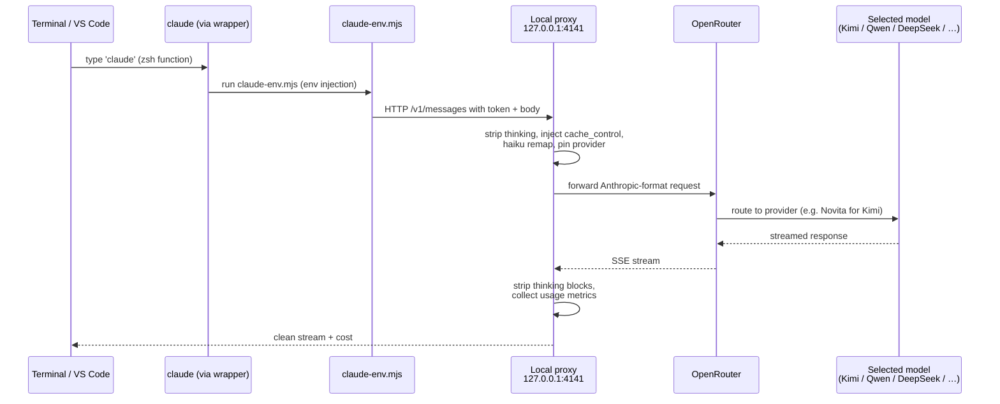
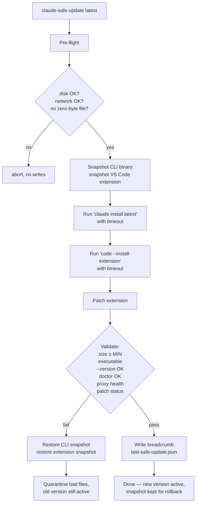

# Architecture

How the installer turns Claude Code into an OpenRouter-aware client without losing any feature.

## Request Flow



## Components

| Component | Path | Role |
|---|---|---|
| **Original Claude Code** | `~/.local/bin/claude` (symlink) | Untouched. Handles all tools, file ops, MCP, agent protocol. |
| **`claude-env.mjs`** | `~/.claude/openrouter-claude-proxy/` | Forwards allowed `settings.env` keys (token, base URL, telemetry off, model metadata). Spawns original `claude`. |
| **Wrappers** | `~/.local/bin/claude-*` | Shell scripts. `claude` zsh function routes to `claude-full`. `claude-router` is the registry CLI. |
| **Local proxy** | `~/.claude/openrouter-claude-proxy/server.mjs` | HTTP listener on `127.0.0.1:4141`. Sanitizes, caches, pins, remaps. |
| **Model registry** | `~/.claude/openrouter-claude-proxy/model-registry.json` | Single source of truth for roles → aliases → OpenRouter IDs + observed cache/provider data. |
| **`modelctl.mjs`** | `~/.claude/openrouter-claude-proxy/` | Backs `claude-router` / `or-model` commands (status, add, use, remove, cleanup). |
| **`safe-update.mjs`** | `~/.claude/openrouter-claude-proxy/` | Snapshot → install → validate → rollback updater. |
| **Patcher** | `~/.claude/openrouter-claude-proxy/patch-extension.mjs` | Hides `redacted_thinking` UI errors, forces extension thinking off. Re-applies on extension updates. |
| **Doctor** | `~/.claude/openrouter-claude-proxy/doctor.mjs` | Read-only diagnosis. Drift, cache readiness, last metrics. |
| **LaunchAgent** | `~/Library/LaunchAgents/com.codex.openrouter-claude-proxy.plist` | Keeps proxy running, re-patches extension every 60 s. |

## Proxy Pipeline

Each request goes through this pipeline in order. Each step is independently switchable via env flag.

```text
┌──────────────────────────┐
│ Inbound /v1/messages     │
└──────────┬───────────────┘
           ↓
[1] applyInternalHaikuRemapIfSafe   ── catches Claude Code's silent
                                       background haiku calls; swaps to
                                       cheapFull only if all safety gates
                                       pass (no tools, ≤2 messages, ≤4K body)
           ↓
[2] sanitizeRequestBody             ── strips `thinking` / `reasoning` /
                                       `extended_thinking` unless
                                       reasoning policy allows pass-through
           ↓
[3] applyPromptCacheIfSafe          ── PROMPT_CACHE=auto: injects
                                       cache_control on last system block
                                       and last user content block (if
                                       Claude Code didn't already)
           ↓
[4] applyProviderPinIfSafe          ── PIN_PROVIDER=1: adds OpenRouter
                                       `provider` preference from registry
                                       observed.latestProvider — locks
                                       provider for cache continuity
           ↓
[5] forward to OpenRouter
           ↓
[6] streamSanitizedSse              ── per chunk: drops thinking blocks,
                                       captures usage with max-wins
                                       absorbUsage, redacts metrics
           ↓
[7] writeMetrics                    ── privacy-safe last-metrics.json
                                       (and JSONL if DEBUG_TOKENS=1)
```

## Reasoning Policy

Default: every request strips `thinking`/`reasoning` fields. This stops hidden token burn.

Exception (allowlist in registry):

```json
"compatibility": { "reasoningPassThrough": true }
```

When **all** of these are true, reasoning passes through:
1. Model has `reasoningPassThrough: true` in registry
2. Request has `effort: "high"` (or explicit `thinking.type: "enabled"`)
3. Model id matches a registry entry

Today only `deepseek-v4-pro` is allowlisted. Kimi/Qwen/GLM/HY3 strip reasoning even on `/effort high`.

## Internal-Haiku Remap

Claude Code makes silent background calls (session naming, summaries) using its built-in haiku model. These bypass your `cheapFull` slot.

Remap intercepts them:

```text
selected: claude-haiku-4-5-20251001  → remapped to: qwen/qwen3.6-plus
```

Patterns (registry):
```json
"sourceModelPatterns": [
  "claude-haiku-*",
  "claude-*-haiku*",
  "anthropic/claude-haiku-*",
  "anthropic/claude-*-haiku*"
]
```

Safety gates (all must pass; otherwise no remap):
- Source contains `claude-cli` (not from external SDK)
- Message count ≤ 2
- System chars ≤ 2000
- Tool count == 0 (would never remap a real coding request)
- Body bytes ≤ 4096

If a future Haiku name doesn't match the patterns, the request goes through unmodified — **fail-safe, not fail-broken**.

## Caching Strategy

OpenRouter exposes Anthropic-compatible `cache_control: {type: "ephemeral"}` markers. Effective combinations:

| Model | Provider | Cache works? | Notes |
|---|---|---|---|
| Kimi K2.6 | **Novita** (pinned) | ✅ confirmed | Turn 1 → Turn 2: cache_read 2,048 → 16,896. 57% cost drop. |
| Kimi K2.6 | Inceptron, others | ⚠️ varies | Provider rotation breaks cache continuity. |
| Qwen 3.6 Plus | Alibaba | partial | Reports `cache_creation_input_tokens` but no `cache_read`. Flat cost. |
| DeepSeek V4 Pro | AtlasCloud | weak | `cache_read` 0 → 1,536 over 2 turns. Use sparingly. |
| GLM 5.1 | Z.AI | weak | Tiny cache_read observed. |

**Provider pinning** (PIN_PROVIDER=1) reads `observed.latestProvider` from the registry and adds an OpenRouter `provider` preference, forcing the same provider on every call so cache survives across turns.

## Update Path



## Path Templating

Repo files use placeholders that the installer renders at install time:

```text
__HOME__   → target user's $HOME
__NODE__   → result of `which node` on target Mac
```

This makes the same repo install correctly on any Mac regardless of username — every path is rendered to the target user's `$HOME` at install time.

## Locked Boundaries

The installer **detects but does not modify**:

```text
~/Library/Application Support/Claude       (Claude Desktop)
~/.claude/plugins                          (caveman, other user plugins)
~/.claude/projects                         (your session histories)
~/Documents, ~/Downloads                   (your files)
```

The installer writes only to:

```text
~/.claude/openrouter-claude-proxy/         (proxy code, registry)
~/.claude/settings.json                    (env block, merge mode)
~/.claude/installer-backups/               (backups before any write)
~/.local/bin/claude-*                      (wrappers)
~/Library/LaunchAgents/com.codex.openrouter-claude-proxy.plist
~/Library/Application Support/Code/User/settings.json (only the 4 claudeCode.* keys)
```
