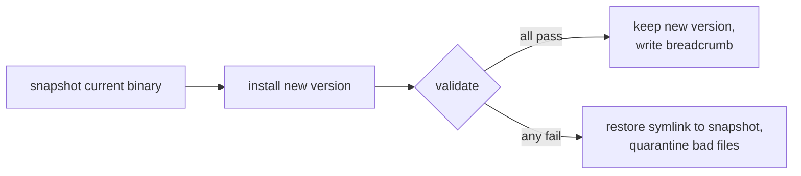

# Update Guide

Two things can update independently: **the installer repo** and **Claude Code itself**.

## Update This Repo (proxy / wrappers / scripts)

```sh
git pull
./install.sh --dry-run    # preview changes
./install.sh --upgrade    # apply
```

The `--upgrade` flow:
- Backs up everything to `~/.claude/installer-backups/openrouter-lts-<stamp>/`
- Preserves your token in `~/.claude/settings.json`
- Preserves your model role choices in the registry (unless `--reset-registry`)
- Refreshes proxy code, wrappers, doctor, scripts

After update:

```sh
./verify.sh
node ~/.claude/openrouter-claude-proxy/doctor.mjs
```

## Update Claude Code CLI (snapshot + rollback)

**Always use `claude-safe-update`. Never use raw `claude install` or `claude update`.**

```sh
claude-safe-update latest --dry-run    # preview
claude-safe-update latest              # actual update
```

What it does:



Validation checks:
- New binary size ≥ minimum
- Binary executable
- `claude --version` works
- `doctor` reports proxy OK, drift false, no extension mismatch
- Proxy health responds
- Extension patch dry-run passes

If anything fails, your old version stays active. You will not be left in a broken state.

### Optional: post-update model probe

This spends a tiny amount of OpenRouter credit (~$0.001) to confirm the new CLI version still produces correct request shape:

```sh
claude-safe-update latest --probe --allow-model-call
```

**Both flags required.** `--probe` alone does not spend tokens; `--allow-model-call` is the explicit consent to spend.

### Manual rollback

Snapshots live at `~/.claude/binary-snapshots/`. To roll back:

```sh
ls ~/.claude/binary-snapshots/
ln -sfn ~/.claude/binary-snapshots/claude-2.1.131-<hash> ~/.local/bin/claude
claude --version    # confirm
```

## Why Auto-Update Is Disabled

`DISABLE_AUTOUPDATER=1` is set in the LaunchAgent and forwarded by `claude-env.mjs`. This stops Claude CLI from silently downloading updates that could:
- Land mid-session and break tool calls
- Introduce a 400 error from a new beta header that OpenRouter doesn't accept
- Corrupt the binary (the original symptom that motivated `claude-safe-update`)

The `claude-safe-update` command is the **only** sanctioned update path.

## Update VS Code Extension

The extension auto-updates via VS Code marketplace. The installer's LaunchAgent re-runs the patcher every 60 s, so any new extension version is auto-patched within a minute:

```sh
node ~/.claude/openrouter-claude-proxy/patch-extension.mjs --dry-run    # check status
```

If a future extension version's minified code breaks the patcher's regex, you'll see `pattern-missed` in `~/.claude/logs/openrouter-claude-proxy.log`. Fix:

1. Open an issue with the new extension version number
2. Update the regex in `payload/openrouter-claude-proxy/patch-extension.mjs`
3. Re-run the installer to deploy

Manual rollback of extension patches:

```sh
node ~/.claude/openrouter-claude-proxy/patch-extension.mjs --rollback
```

## Migration Strategy

When LTS version bumps in `manifest.json`:

| Old → New | Action |
|---|---|
| Patch (e.g. `2026.05.07-1` → `2026.05.07-2`) | `git pull && ./install.sh --upgrade` |
| Minor (e.g. `2026.05.07` → `2026.06.01`) | Read CHANGELOG, then `./install.sh --upgrade` |
| Major (registry schema bump) | Read migration notes, manual review of registry, then `./install.sh --upgrade` |

The breadcrumb at `~/.claude/logs/last-safe-update.json` and the installer backups make every step reversible.
